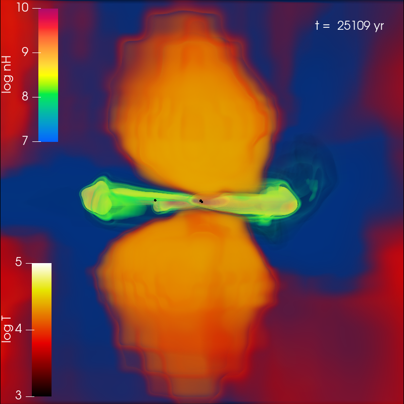
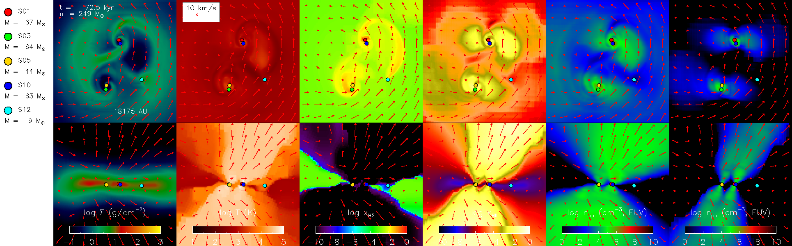

Click the below images to see the movies. Each figure links to a page with a specific topic.
See also a compilation of movies on [Youtube](https://www.youtube.com/@jp_astro_simulation/videos).

### TRAJECTORIES OF POPULATION III PROTOSTARS

### RADIATIVE FEEDBACK FROM POPULATION III PROTOSTARS

### FORMATION OF MULTIPLE POPULATION III STARS

<!--
### STAR FORMING REGION
{:target="_blank_"}
{:target="_blank_"}    
-->
