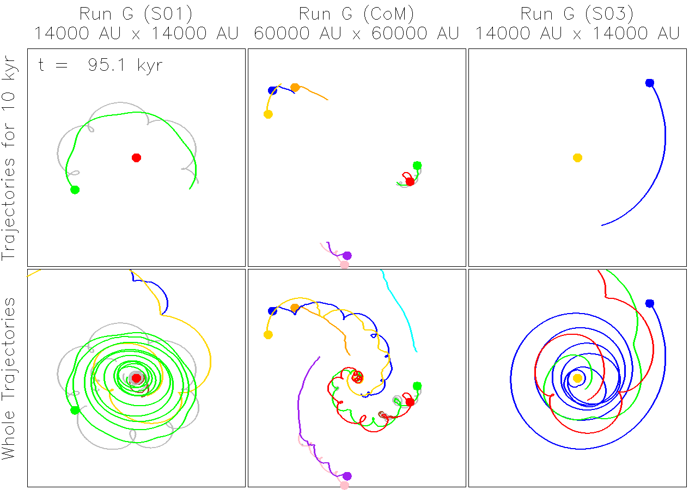
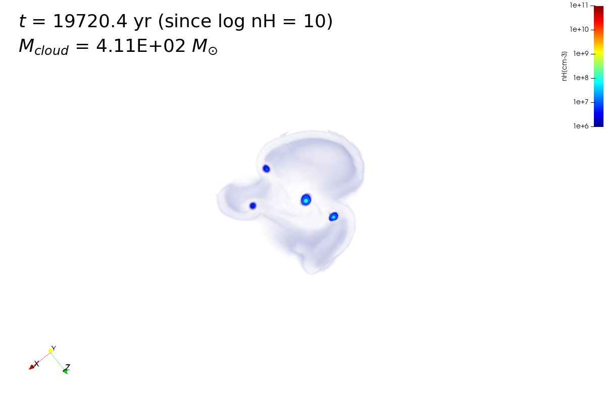
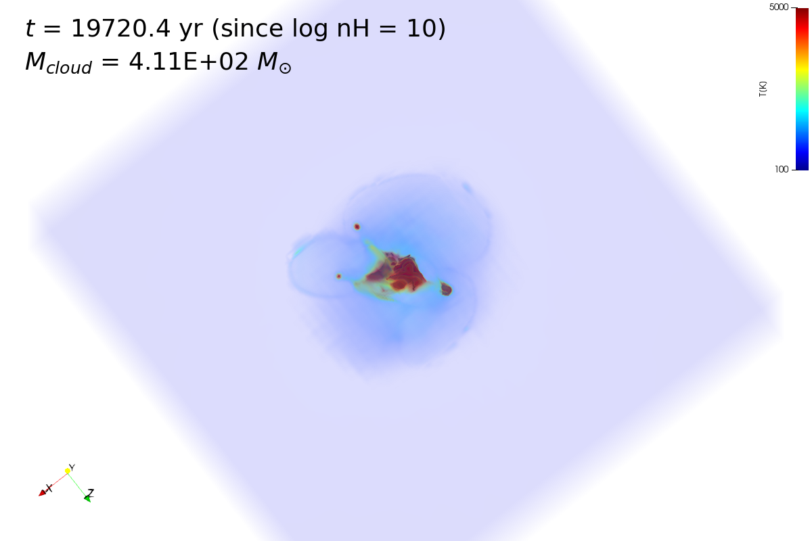

### TEST

### RADIATIVE FEEDBACK FROM POP III PROTOSTARS
<iframe width="1080" height="630" src="https://www.youtube.com/embed/DEBqgUmGgCk" title="YouTube video player" frameborder="0" allow="accelerometer; autoplay; clipboard-write; encrypted-media; gyroscope; picture-in-picture" allowfullscreen></iframe>

### FORMATION OF MULTIPLE POPULATION III STARS
<iframe width="1080" height="630" src="https://www.youtube.com/embed/dFuQVl5JpVA" title="YouTube video player" frameborder="0" allow="accelerometer; autoplay; clipboard-write; encrypted-media; gyroscope; picture-in-picture" allowfullscreen></iframe>

### STAR FORMING REGION
{:target="_blank_"}
{:target="_blank_"}    

Click the above images to see the animations. This is the density and temperature
of a star forming region in a small dark matter halo in the early Universe.
