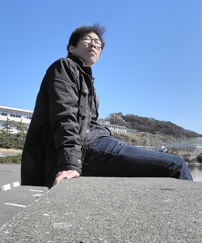
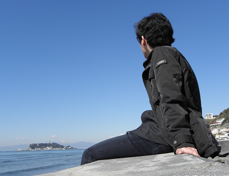

 

### JONGWON PARK
I am a Ph.D. candidate in the Astronomy Department at the University of Maryland, College Park. 
I got my bachelor's and master's degree from Yonsei University in South Korea and worked on various topics of galaxy evolution with professor Sukyoung K. Yi.
I moved to the University of Maryland in 2018 and have been working with professor Massimo Ricotti.    
    
My research interest is the formation of Population III stars and their feedback. 
To study them, I make use of radiative hydrodynamics code RAMSES-RT and carry out computer simulations. 
My job includes implementing various physics (chemistry, radiative processes, etc.), performing simulations using a supercomputer, and understanding the results physically.

### CV
[[CV](https://www.astro.umd.edu/~jwpark/data/CV.pdf){:target="_blank_"}]

### RESEARCH INTERESTS
* Formation of the First Stars and Galaxies
* Feedback Mechanisms of the First Stars

### PERSONAL HISTORY
* 2018.09 - Current: Graduate Student, University of Maryland
* 2017.03 - 2018.06: Post Master Researcher
* 2015.03 - 2017.02: M.S., Yonsei University
* 2008.08 - 2010.10: Military Service (Republic of Korea Air Force)
* 2008.03 - 2015.02: B.S., Yonsei University
